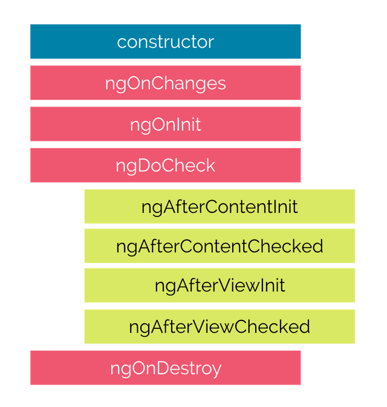

# Angular

Angular is a framework built on TypeScript. Angular includes:

- A component-based framework to create single-page applications and scalable applications.
- A collection of well-defined libraries that include many features like routing, and client-server management etc.
- Tools to develop, build, test and deploy a front-end application.


Angular should be preferred as a front-end framework when:

1. Developing Large scale dynamic applications

   - Reusable components make it easier to build and manage complex architecture and dynamic elements.

2. Developing PWAs and SPAs

   - Progressive Web Applications (PWA): A website that is similar to a mobile app is called PWA. The goal of PWA is to blur the gap between native apps and the mobile web.

   - Single Page Application (SPA): A single page application is a web app which is built with multiple components, unlike normal web pages, SPA's are loaded only once and they improve the user experience by avoiding multiple web pages and waiting time to load the webpages.

3. Developing cross-platform applications

   - Angular web apps are compatible with both desktop and mobile.

4. You have a massive project with massive team

   - Many developers can work on the same Angular project without any maintenance and error debugging issues.


Angular is widely used as a frontend framework for many webpages, a few famous webpages built using Angular are:

1. Google
   - Google Play Store
   - Google Voice App
   - G Suite Homepage
   - Google Open Source
   - Google Play Books
   - Google Arts and Culture
   - Google.org Website 
   - Gmail

2. Microsoft Xbox
    - Microsoft Homepage
    - Microsoft Azure
    - Microsoft Flow
    - TimeFind
    - Microsoft Support Page

3. Forbes
4. Paypal
5. Deutsche Bank
6. UpWork
7. The Guardian 
8. Weather.com

# Angular JS vs Angular

- AngularJS is the first version of Angular or Angular1.X. 


The main differences between AngularJS and Angular are:

| AngularJS                                                                                     | Angular                                                |
| --------------------------------------------------------------------------------------------- | ------------------------------------------------------ |
| JavaScript based                                                                              | TypeScript based                                       |
| Uses Directives                                                                               | Uses Components                                        |
| Uses the ng-model directive for two-way binding and the ng-bind directive for one-way binding | Uses ngModel directive for one-way and two-way binding |
| MVC (model-view-controller) based framework                                                   | Component-based framework                              |
| Doesn’t provide mobile support                                                                |  Provides mobile support                               |
| Relies on third-party tools as IDE and WebStorm                                               | Uses Command Line Interface (CLI)                      |


Angular setup is a quick process, and the requirements are

1. Node.js should be installed.
2. Node package manager (npm), which is installed along with Node.js is required to build and run Angular applications.
3. Finally Angular CLI is installed using npm.

**Node.js**

- Node.js is a JavaScript runtime built on Chrome V8 JavaScript engine.
- Node.js is used for web development, Mobile development, Desktop Development and IoT development.

**NPM**

- The npm(Node Package Manager) is installed with Node.js.
- npm is used to download all public software packages like Angular.
- The npm is open source and developers use it to share software.


### Single Page Application

SPA (Single Page Application) is a web application that dynamically rewrites a single web page with new data from the server.

- The following image explains the working of SPA.

- For initial request from the client, an HTML page is the response.
- From the second request the page is dynamically rewritten using JavaScript APIs.


### Benefits of using SPA

- **Quick loading time**: Unlike MPA (Multi-page application) HTML page is loaded only once in SPA.
- **fluid user experience**: SPA's provide an experience like a desktop or mobile app.
- **Ease in building feature-rich apps**: Adding new features to a web application is easy in SPA.
- **Less bandwidth use**: SPA's load page only once. So, they consume less bandwidth.

### Drawbacks of using SPA

- SPA loads a single page, which is a disadvantage for SEO.
- SPA requires many browser resources.
- SPA's are prone to cross-site scripting attacks, this causes security issues.


## @NgModule

Every Angular application consists of at least one module, the root module. We bootstrap that module to launch the application.

NgModules are TypeScript classes decorated with the [@NgModule](https://angular.io/api/forms/NgModel) decorator imported from the `@angular/core` package.

NgModule takes metadata and describes how to compile a component's template and how to create an injector at runtime. It identifies the module's components, directives, and pipes and makes them public through the export property which can be used by external components.

The Angular CLI generates the basic *AppModule* (src/app/app.module.ts file) when creating a new application.

`@NgModule` takes the below metadata to launch the application:

- **declarations** —  contains a list of components, directives, and pipes, which belong to this module. 

- **imports** —  contains a list of modules, which are used by the component templates in this module reference.  For example, we import *BrowserModule* to have browser-specific services such as DOM rendering, sanitization, and location. 

- **providers** — the list of service providers that the application needs.

- **bootstrap** — contains the root component of the application.

Angular CLI creates an application with one component (AppComponent), so it is in both the declarations and the bootstrap arrays.


## Webpack

- Webpack is a powerful module bundler.
-  A JavaScript file that  contains all the files that belong together and served to client in a response to single file request is called bundle.
-  A bundle can include JS, CSS, HTML and almost any other type of files.

The following files can be configured in webpack:

- **Entry**: The module where webpack starts.
- **Output**: The bundles created by webpack are emmited here.
- **Loaders**: Used in webpack to process more than JavaScript files.
- **Plugins**: A JavaScript object that has an apply method. This apply method is called by the webpack compiler, giving access to the entire compilation lifecycle.


## Component 
Components are building blocks of Angular applications.

A component consists of:
1. An HTML template.
2. A CSS selector.
3. Optional CSS Styles applied to the template
4. A TypeScript class that defines the behaviour of the component.


### Advantages of Angular Components
- Using Angular Components a Single Page Application can be created.
- Angular components are independent. So, if an error occurs with one component, the functionality of the other component might not be affected.
- Angular components support lazy loading (only components necessary at a particular time are loaded and the Application runs smoothly).
- As Angular Components are independent, it is easy to maintain the code.

**Component Decerator**
- `@Component`, is the component decorator which marks the class as an Angular component and provides metadata about how the component works during the runtime.
- Every Angular Project has a default component called, app.component.

* **app.component.css** -  holds all the CSS styles 
* **app.component.html**  -  this template contains typical HTML elements and alters the HTML based on our app's logic and DOM manipulations. 
* **app.component.ts** -  contains typescript code to control the component behaviour.

Let's have a look at the app.component.ts file under the app folder and understand the code behind the root component of the application.

```typescript
import { Component } from '@angular/core';

 @Component ({
 selector: 'app-root',
 templateUrl: './app.component.html' ,
 styleUrls: ['./app.component.css']
 })
 export class AppComponent {
 title = 'my first app';
 } 
```
In this file, we export the *AppComponent* class, and we decorate it with the `@Component` decorator, imported from the `@angular/core` package, which takes a few metadata, such as:

-  **selector:** A CSS selector that tells Angular to create and insert an instance of this component wherever it finds the corresponding tag in template HTML. For example, if an app's HTML contains <app-root></app-root>, then Angular inserts an instance of the AppComponent view between those tags.

- **templateUrl:** The module-relative address of this component's HTML template. Alternatively, you can provide the HTML template inline, as the value of the **template** property. 

-  **styleUrls:** This is an array of relative paths to where the component can find the styles used to style the HTML view. Alternatively, you can provide the CSS Style inline, as the value of the **styles** property.


- A component must belong to the `Ng Module`, for it to be available for another component.

### How to create a component in Angular?

Run the `ng generate component <component_name>` or `ng g c <component-name>` command in the terminal to create a component.


## Components Life Cycle Hooks

- Angular Component Lifecycle is described using the Lifecycle Hooks.

Angular creates a component; renders it; creates and renders its children; checks it when its data-bound properties change; and destroys it before removing it from the DOM. These events are called **Lifecycle Hooks**. These Lifecycle hooks have eight different function calls which correspond to the lifecycle event. Every angular component has a life cycle event carried out in 2 different phases -  one linked to the component itself and the other linked to the children of that component.

## Eight lifecycle hooks in Angular

The below diagram illustrates the order in which the eight hooks are executed.



**constructor()** - The constructor of the component class gets executed first, before the execution of any other lifecycle hook events. If we need to inject any dependencies into the component, then the constructor is the best place to do so.

#### Lifecycle Hooks

**ngOnChanges()** - Called whenever the input properties of the component change. It returns a *SimpleChanges* object which holds any current and previous property values.

**ngOnInit()** - Called once to initialize the component and set the input properties. It initializes the component after Angular first displays the data-bound properties. 

**ngDoCheck()** - Called during all change-detection runs that Angular can't detect on its own. Also called immediately after the `ngOnChanges()` method.

**ngAfterContentInit()** - Invoked once after Angular performs any content projection into the component’s view.

**ngAfterContentChecked()** - Invoked after each time Angular checks for content projected into the component. It's called after `ngAfterContentInit()` and every subsequent `ngDoCheck()`.

**ngAfterViewInit()** - Invoked after Angular initializes the component's views and its child views.

**ngAfterViewChecked()** - Invoked after each time Angular checks for the content projected into the component. a It called after `ngAfterViewInit()` and every subsequent `ngAfterContentChecked()`.

**ngOnDestroy()** - Invoked before Angular destroys the directive or component.


# Sharing data between child and parent components

In Angular data is shared among the parent and child components using

Angular uses `@Input` and `@Output` decorators to flow data between components. We can also use Angular services to flow data between the components. If we have to pass data into a component we use the `@Input` decorator, and if we have to emit the event or data from a component we use the `@Output` decorator with the `EventEmitter` API.


### `@Input` decorator

In Angular, the [`@Input`](https://angular.io/api/core/Input) decorator is defined in the [@angular/core](https://angular.io/api/core) package that marks a class field as an **input property** and supplies configuration metadata.


### Component events with EventEmitter and `@Output`

In Angular, a component can emit an event using [`@Output`](https://angular.io/api/core/Output) and [EventEmitter](https://angular.io/api/core/EventEmitter) API in the [@angular/core](https://angular.io/api/core) package.

`@Output` decorator that marks a class field as an **output property** and supplies configuration metadata.


### Event Emitters in Angular

An [EventEmitter](https://angular.io/api/core/EventEmitter) is used to emit custom events synchronously or asynchronously, and register handlers for those events by subscribing to an instance.


### Directives

 A Directive is a custom HTML element or attribute used to power up and extend our HTML 

- Directives fall into one of three categories
    - Component Directive: established in the selector attribute of the @Component decorator 
    - Structural Directive: changes the structure or layout of a view by manipulating, adding, or removing elements and their children 
        - `*ngIf`: takes a boolean expression and makes an entire chunk of the DOM appear or disappear (exposed in BrowserModule)
        - `*ngFor`: used to create for loops, at minimum needs a looping variable and a list (exposed in BrowserModule)
        - `ngSwitch` : (actually a set of directives and ngSwitch is an attribute directive since it controls the behaviour of *ngSwitchCase and *ngSwitchDefault)
            - ngSwitch
            - *ngSwitchCase
            - *ngSwitchDefault
    - Attribute Directive: listens to and modifies the behaviour of other elements, attributes, properties, and components. However, usually applied to attributes 
        - NgClass : adds and removes a set of CSS classes 
        - NgStyle : adds and removes a set of HTML styles
        - NgModel : allows for two-way data binding to an HTML form element (exposed in FormsModule)

### Differences between Directives and Components

In a short note, A component(@component) is a directive-with-a-template.

- Some of the major differences are mentioned in a tabular form

    | Component | Directive |
    |---- | ---------
    | To register a component we use @Component meta-data annotation  | To register directives we use @Directive meta-data annotation |
    | Components are typically used to create UI widgets| Directive is used to add behaviour to an existing DOM element |
    | Component is used to break up the application into smaller components| Directive is used to design re-usable components|
    | Only one component can be present per DOM element | Many directives can be used per DOM element |
    | @View decorator or templateurl/template are mandatory | Directive doesn't use View|


<br>
<i> <b>Note</b>: detailed explanation about attribute directives and structural directives will be given in the upcoming modules.</i> 


## Content Projection

Content projection is the process of inserting or projecting the content into the desired component.

### Implementations of contnet projection

1. Single-slot content projection: projecting content to a component from a single source.
2. Multi-slot content projection: projecting content to a component from multiple sources.
3. Conditional content projection: the content projected is rendered only when the conditions are satisfied.

### <ng-content>

`<ng-content>` is a placeholder, used to project the message into the component.

- `<ng-content>`, `<ng-template>` and `<ng-container>` are used for content projection


## Binding

- The data transfer between the part of the Template and the model is called Binding.
- Binding is used to synchronize the view and model, and the Change detection algorithm is used for this process.

### One way binding


1. Text Interpolations: Text interpolation is a one-way transfer of data from a TypeScript file in a model to an HTML template.
2. Property Binding: The properties of HTML elements in the template can be dynamically modified by transferring data from TypeScript. it is used to set a specific element property.
3. Event Binding: Listens for an element change event. Mostly event binding is used to listen to user actions.

Other types of binding are :

1. Attribute binding: Used to improve accessibility, style the application dynamically and manage multiple CSS classes and styles simultaneously. 
2. Class and style binding:  Used to add and remove CSS class names from an element's class and also to set styles dynamically.

## 2-way binding
Conventionally two-way binding is achieved by combining property binding/text interpolation and event binding, but in Angular, this is achieved by "[()]". Two-way binding is used to listen for events and update values.


## Pipes

In any full stack application, the data is received from the backend in HTTP format. when that data is displayed on the HTML page, the format should be changed. The pipes are used to transform data from one form to other.

Pipes are classified into two types.

1. Default Pipes
2. Custom Pipes

Data, currency, case and percent are a few commonly used default pipes.

The syntax for pipe is:

```html
{{ text | pipe_name }}
```
where `{{}}` represent the Text interpolation and `|` is the syntax for the pipe.

Template Driven and Reactive Froms:  

Angular provides two approaches for building forms: Template-driven forms and Reactive forms. Both approaches have their own advantages and are suitable for different scenarios. Here's a detailed explanation of each approach and how to implement them in Angular:

1. Template-driven forms:
   Template-driven forms are the simpler approach and are primarily driven by the template HTML. Form controls are created and bound directly in the template using directives such as `ngModel`. Here's how you can implement template-driven forms:

   Step 1: Import the `FormsModule` in your Angular module:
   ```typescript
   import { FormsModule } from '@angular/forms';

   @NgModule({
     imports: [FormsModule],
     // ...
   })
   export class AppModule { }
   ```

   Step 2: Create a form in your component template:
   ```html
   <form #myForm="ngForm" (ngSubmit)="onSubmit(myForm.value)">
     <label for="name">Name:</label>
     <input type="text" id="name" name="name" ngModel required>

     <label for="email">Email:</label>
     <input type="email" id="email" name="email" ngModel required email>

     <button type="submit">Submit</button>
   </form>
   ```

   Step 3: Handle form submission in your component:
   ```typescript
   export class MyComponent {
     onSubmit(formData: any) {
       // Process the form data
       console.log(formData);
     }
   }
   ```

   Template-driven forms are suitable for simple forms with basic validation requirements. They are quick to set up but can become harder to maintain for complex forms.

2. Reactive forms:
   Reactive forms provide a more flexible and scalable approach. They are driven by reactive programming and allow you to manage form state programmatically. Here's how you can implement reactive forms:

   Step 1: Import the `ReactiveFormsModule` in your Angular module:
   ```typescript
   import { ReactiveFormsModule } from '@angular/forms';

   @NgModule({
     imports: [ReactiveFormsModule],
     // ...
   })
   export class AppModule { }
   ```

   Step 2: Create a form in your component using the FormBuilder service:
   ```typescript
   import { FormBuilder, FormGroup, Validators } from '@angular/forms';

   export class MyComponent {
     myForm: FormGroup;

     constructor(private formBuilder: FormBuilder) {
       this.myForm = this.formBuilder.group({
         name: ['', Validators.required],
         email: ['', [Validators.required, Validators.email]],
       });
     }

     onSubmit() {
       if (this.myForm.valid) {
         const formData = this.myForm.value;
         // Process the form data
         console.log(formData);
       }
     }
   }
   ```

   Step 3: Bind the form controls in your component template:
   ```html
   <form [formGroup]="myForm" (ngSubmit)="onSubmit()">
     <label for="name">Name:</label>
     <input type="text" id="name" formControlName="name">

     <label for="email">Email:</label>
     <input type="email" id="email" formControlName="email">

     <button type="submit" [disabled]="myForm.invalid">Submit</button>
   </form>
   ```

   Reactive forms provide better control over form validation, dynamic form control creation, and complex form scenarios. They are suitable for larger forms and applications where form state management is critical.

Both template-driven and reactive forms offer features like data binding, validation, and error handling. The choice between them depends on the complexity and requirements of your form. Reactive form are used for complex forms.


## Services and DI

# Description

**Service** : A TypeScript class to share data or functionality throughout the application.

Uses of service:

- Code reuse
- Cross-component communication

**Dependency injection**: A coding pattern in which a class receives the instances of the objects it needs (called dependencies) from an external source rather than creating them itself.

A service can be created and injected in the following steps:

1. Create a class and decorate it with the @Injectable decorator and export it.

1. Register the provider => a provider is a code that can create or return a service 
    - We can add the service to the provider's property in either:
      - @Component => Injectable to component and its children. 
      - @NgModule => Injectable everywhere in an application .
2. Inject the Service
    - We achieve dependency injection in the constructor of the class in which we wish to use the service. 
    - Similar to Java, every class has an implicit no-arg constructor if no other constructor is defined.
    - To inject dependencies, we need an explicit constructor passing in the service to be injected. 

 ```ts
    export class MyComponent {
                constructor(private myService: MyService) {}
            }
```

[Angulat DI]('https://angular.io/guide/dependency-injection')  - Refer the official documentation for additional information


## Publisher Subscriber Design Pattern


- The pub/sub (Publisher/Subscriber), is an architectural design pattern in which publisers and subscribers communicate with one another.
- A message handeller acts as a middleware between the publishers and subscribers.
- Messages (events) are sent out by the host (pubisher) to the message queue (event channel), subscribers join the message queue.

The following picture explains the pub/sub design pattern.


**Pro's of Pub/Sub design pattern:**

- Scales with multiple receivers
- Great with microservices
- Loose Coupling
- Works while client is not running


**Con's of Pub/Sub design pattern:**

- Message delivery issues
- Complex
- 

Consider a user uploading a video in youtube.


1. The upload service will take the video and sends response to user once the video is uploaded and after that the user can disconnect.
2. The upload service will publish the raw mp4 video to th message queue.
3. The compress service is subscribed to Raw mp4 video and will receive raw mp4 and process it and publishes compressed video.
4. The format service is subscribed to compressed video topic and it publishes theh 480p, 1080p and 4k video.
5. The notification service is subscribed to 4k video and sends the notification in youtube.


## Observer design pattern

Observer pattern is used to implement one-to-many relationship between objects. If one object is modified, its depenedent objects are notified automatically. Observer pattern falls under behavioral pattern category.

The following image explains the observer pattern.


The two main stratergies in observer pattern are:

1. **Push**: when an event happens the Observable object will send new data to all the Observers and notifies them.
2. **Pull**: when a event happens the Observable object will notify all the observers but unlike push each observer will pull the information it needs from the Observable.

## RxJS Observable

RxJS is the most popular library for Observer design pattern. The data can be:

- **Observable**: An invokable collection of future values or events
- **Observer**:A collection of callbacks thet listens to values delevered by the Observable.
- **Subscription**: Execution of an Observable, also useful for cancelling the execution.
- **Operators**: Functions to perform actions  like map, filter,concat and flatMap etc.
- **Subject**: Simmilar to EventEmmiter, used to multicast a value or event to multiple Observers.
- **Schedulers**: Centralized dispatchers to control concurrency.
- 

A  RxJS Subject is special type of Observable that multicasts to many Observers.

- Every Subject is an Observable. A Subject can be subscribed providing an Observer. From the perspective of the Observer, it is ambigious to tell of the Observable execution is coming from Observable or a Subject.
- Every Subject is an Observer. It is an object with methods `next(v)`, `error(e)` and `complete()`. `next(theValue)` can be used to feed a value to the subject and it will be multicasted to the Observers registered to listen to the Subject.

RxJS Operators:

Operators are functions. There are two kinds of operators:

**Pipeable Operators** are the kind that can be piped to Observables using the syntax observableInstance.pipe(operator) or, more commonly, observableInstance.pipe(operatorFactory()). Operator factory functions include, filter(...), and mergeMap(...).

When Pipeable Operators are called, they do not change the existing Observable instance. Instead, they return a new Observable, whose subscription logic is based on the first Observable.

A Pipeable Operator is essentially a pure function which takes one Observable as input and generates another Observable as output. Subscribing to the output Observable will also subscribe to the input Observable.

```ts
import { of, first } from 'rxjs';

of(1, 2, 3)
  .pipe(first())
  .subscribe((v) => console.log(`value: ${v}`));

// Logs:
// value: 1
```

**Creation Operators**

Creation operators are distinct from pipeable operators, creation operators are functions that can be used to create an Observable with some common predefined behavior or by joining other Observables.

A typical example of a creation operator would be the interval function. It takes a number (not an Observable) as input argument, and produces an Observable as output:

```ts
import { interval } from 'rxjs';

const observable = interval(1000 /* number of milliseconds */);
```

### Http Client

- To download or upload data and access other back-end services, most front-end applications must communicate with a server using the HTTP protocol. The HttpClient is a lightweight, easy-to-use, and robust HTTP client library. It allows developers to collect external data and post, get etc.

- The `HttpClient` Module is already included when creating a new Angular app. We just need to register it in our Angular application. In `src/app/app.module.ts` file, import the *HttpClient* module to make use of the *HttpClient* service.

```typescript
import { HttpClient }    from '@angular/common/http';
```
Also, include the HttpClientModule in `@NgModule`'s imports array.
```typescript
@NgModule({
  imports: [
    BrowserModule,
    HttpClientModule
   ]
})
```

### Route Gaurds

# Description

Angular Route guards can be used to control weather the user can navigate to or away from the giver route based on some condition. In simpler terms an Angular Route guard is used to secure a route.

### Uses of Route guard:


- To confirm the navigation operation
- Asking weather to save data before moving away from the view.
- Allow access to certain parts of the application to specific users.
- Validating the route parameters before navigating to the route.
- Fetching some data before you display the component view.

### Types of Route guards in Angular

1. `CanActivate`: Decides if a route can be activated or not based on a given condition. 
2. `CanDeactivate`: Checks criteria before leaving a route
3. `Reslove`: Used to prefetch data before we navigate to a route
4. `CanLoad`: Decides if children can be loaded or not
5. `CanActivateChild`: Similar to the `canActivate` guard except that it is called when activating a route child and not the route itself.


**Step 1:**
- Creating a guard service.

**Step 2:**
- This class should implement any route guard interface.

```ts
import { CanActivate } from "@angular/router";

export class RouteGuardService implements CanActivate{
    

}
```

**Step 3:**
- The service class should implement the method of the route guard interface.
- The route guard method returns a boolean value.
- If it returns true the navigation is allowed else the navigation process is stopped.

```ts
import { ActivatedRouteSnapshot, CanActivate, RouterStateSnapshot, UrlTree } from "@angular/router";
import { Observable } from "rxjs";

export class RouteGuardService implements CanActivate{
    canActivate(route:ActivatedRouteSnapshot, state:RouterStateSnapshot): boolean{
        return true;
    }
}
```

**Step 4:**
- The service created should be provided using the providers array in app module.

app.module.ts

```ts
import { NgModule } from '@angular/core';
import { BrowserModule } from '@angular/platform-browser';

import { AppComponent } from './app.component';
import { RouteGuardService } from './routegaurd.service';

@NgModule({
  declarations: [
    AppComponent
  ],
  imports: [
    BrowserModule
  ],
  providers: [RouteGuardService],
  bootstrap: [AppComponent]
})
export class AppModule { }
```


**Step 5:**

- The created route guard service is used in any route in the application.

app.routing.module.ts


```ts
{path: 'pathName', component: componentName, canActivate: [RouteGuardService] },
```

## Lazy loading

Lazy loading is a feature in Angular that allows you to load modules only when they are needed, improving the initial loading time and reducing the overall bundle size of your application. Lazy loading is especially useful for large applications with multiple feature modules. Here's an explanation of lazy loading in Angular along with an implementation example:

In Angular, lazy loading works by splitting your application into multiple feature modules, and each module is loaded separately when the user navigates to a specific route that requires that module.

Implementation Steps:
1. Create a feature module: First, create a feature module that you want to lazily load. You can generate a new module using the Angular CLI command:
```bash
ng generate module feature --routing
```
This command will create a new module with a routing module.

2. Configure lazy loading in the routing module: In the routing module of the feature module (`feature-routing.module.ts`), define the route for the lazy-loaded module using the `loadChildren` property. The `loadChildren` property takes a string that specifies the path to the module file (relative to the current module file) using the `#` symbol followed by the module's class name.
```typescript
import { NgModule } from '@angular/core';
import { Routes, RouterModule } from '@angular/router';

const routes: Routes = [
  {
    path: 'lazy',
    loadChildren: () => import('./lazy-module/lazy-module.module').then(m => m.LazyModuleModule)
  }
];

@NgModule({
  imports: [RouterModule.forChild(routes)],
  exports: [RouterModule]
})
export class FeatureRoutingModule { }
```
In this example, the `LazyModuleModule` is the module that will be lazily loaded when the `/lazy` route is accessed.

3. Update the app routing module: In the app routing module (`app-routing.module.ts`), configure the route for the lazy-loaded module. Use the `loadChildren` property and provide the path to the feature module's routing module.
```typescript
import { NgModule } from '@angular/core';
import { Routes, RouterModule } from '@angular/router';

const routes: Routes = [
  {
    path: 'feature',
    loadChildren: () => import('./feature/feature-routing.module').then(m => m.FeatureRoutingModule)
  }
];

@NgModule({
  imports: [RouterModule.forRoot(routes)],
  exports: [RouterModule]
})
export class AppRoutingModule { }
```
In this example, when the `/feature` route is accessed, the `FeatureRoutingModule` is loaded, and the lazy-loaded module's routes are registered.

4. Update the app component template: Finally, update the app component template (`app.component.html`) to include the router outlet where the lazy-loaded module's components will be rendered.
```html
<router-outlet></router-outlet>
```

 when the user navigates to the `/feature` route, the lazy-loaded module will be loaded only at that time, resulting in a smaller initial bundle size and improved performance.

Lazy loading allows you to split your application into smaller, more manageable chunks that are loaded on-demand. This can significantly improve the initial loading time of your application and provide a better user experience.


## Angular Testing


## Automated Testing

- The practice of writing code to test our code and run those tests in an automated fashion.
- Automated testing is more efficient than manual testing.
- Automated tests are used to catch the defects before releasing the software.

## Types of Testing

### Unit Tests

- Angular components are tested in isolation, without external resources(e.g.file system, database, API endpoints) using unit tests.

- Unit tests are easy to write and super fast.

### Integrated Tests

- Angular components are tested with external resources using integration tests.
- Integrated tests are run on a component with a template and a fake service.

### End To End Tests

- The entire application is tested as a whole using the end-to-end test.
- End-to-end tests are very slow and a even small change can break the entire test.

<i>**Note:** Mostly unit tests and integration tests are preferred as end-to-end tests are time consuming and fragile.</i>

## Testing In Angular

- In Angular, Karma is the test runner and Jasmine is the testing framework.
- Karma checks for `component_name.spec.ts` file to run the tests.
- Jasmine has inbuilt funtions like `describe()` and `it()` to write tests.


### Karma


- Angular downloads and installs all the necessary files to the Angular project. When a new project is created, it is ready to be tested using Jasmine and Karma.

## Karma

Karma is a task runner for our tests. It uses a configuration file named `karma.conf.js` in order to set the startup file, the reporters, the testing framework, the browser among other things.

`karma.conf.js`:
```js
// Karma configuration file, see link for more information
// https://karma-runner.github.io/1.0/config/configuration-file.html

module.exports = function (config) {
  config.set({
    basePath: '',
    frameworks: ['jasmine', '@angular-devkit/build-angular'],
    plugins: [
      require('karma-jasmine'),
      require('karma-chrome-launcher'),
      require('karma-jasmine-html-reporter'),
      require('karma-coverage'),
      require('@angular-devkit/build-angular/plugins/karma')
    ],
    client: {
      jasmine: {
        // you can add configuration options for Jasmine here
        // the possible options are listed at https://jasmine.github.io/api/edge/Configuration.html
        // for example, you can disable the random execution with `random: false`
        // or set a specific seed with `seed: 4321`
      },
      clearContext: false // leave Jasmine Spec Runner output visible in browser
    },
    jasmineHtmlReporter: {
      suppressAll: true // removes the duplicated traces
    },
    coverageReporter: {
      dir: require('path').join(__dirname, './coverage/testing'),
      subdir: '.',
      reporters: [
        { type: 'html' },
        { type: 'text-summary' }
      ]
    },
    reporters: ['progress', 'kjhtml'],
    port: 9876,
    colors: true,
    logLevel: config.LOG_INFO,
    autoWatch: true,
    browsers: ['Chrome'],
    singleRun: false,
    restartOnFileChange: true
  });
};

```

### Jasmine


Jasmine is a JavaScript framework that is used to write and execute unit tests and Intergration tests.

Three important parts of jasmine

1. A library with classes and functions for constructing tests.
2. A test execution engine.
3. A reporting engine that outputs test results in different formats

- In jasmine every test consists of one or more suites and each suite consists of one or more specifications.

Suites and specifications are written as:

```js
describe('Suite description', () => {
  it('Spec description', () => {
    /* … */
  });
  /* … more specs …  */
});


1. A function that displayes a welcome message.

welcome.ts

```ts
export function welcomeMessage(name: string){

    return "Welcome "+ name;

}
```

welcome.spec.ts

<i><b>Note:</b> every testing file has an extention spec.ts"</i>

```ts
import { welcomeMessage } from "./welcome";

describe('welcome', ()=>{
    it('should return welcome username',()=>{

        const result= welcomeMessage("Sheldon Cooper");
        expect(result).toContain("Sheldon Cooper");

    })
})
```

- `expect()` is used to the assert the result
- `toContain()` is used to check is a particular string is present in the returned string


karma debug:


2. A function compute that returns 0 if number is negative and increment of number if its positive.

compute.ts

```ts
export function compute(number: number){

    if(number <0){
        return 0;
    }
    else{
        return number +1;
    }

}
```

compute.spec.ts

```ts
import { compute } from "./compute";

describe('compute',() => {
    it('should return zero if number is negative',()=>{

        const result  = compute(-1);
        expect(result).toBe(0);

    })
    it('should return incremnt of number if number is positive',() =>{
        const result = compute(2);
        expect(result).toBe(3);

    })

})
```

- `toBe()` internally uses JavaScript `===`.
- It is used to match the actual and expected values.
- But `toBe()` fails where objects are not identical.
- To check deep equlity `toEqual()` is used.
- There is no difference between the two when comparing primitives. But for objects, `toEqual()` will compare by key/values-content, `toBe()` will compare by object reference.


karma debug:


 


