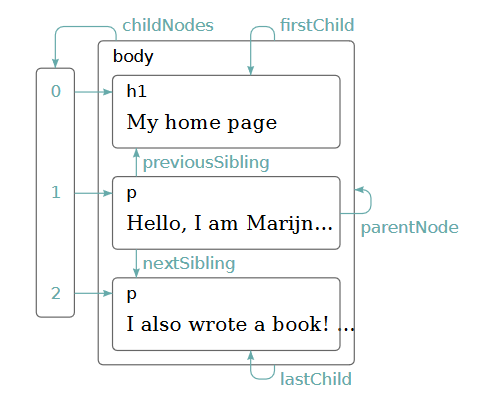

# DOM

- Document Object Model connects web pages to scripts or programming languages by represtenting the structure of document in the form of a logical tree. 
- A scripting language like JavaScript can select and manipulate the content, style and structure of DOM.

## DOM Tree

- Nodes in DOM are elements, text and even comments in the HTML page.

## Selecting DOM componets

Few common selectors are

1. `querySelector()`
2. `querySelectorAll()`
3. `getElementById()`
4. `getElementByClassName()`
5. `getElementByTagName()`

## Traversing Through DOM

## Travering Downwards

- using te selector methods
- using `children` and `childNodes()`
    - `children` returns all the child element nodes.
    - `childNode` returns all the nodes.
- `lastChild`
- `firstChild`

## Traversing Upwards

- `parentElement`
- `parentNode`
- `closest`

## Traversing Sideways

- `nextElementSibiling`
- `previousElementSibiling`

# Event Listener

# Event Handeler

# Event Object

# Event Bubbling and Capturing

