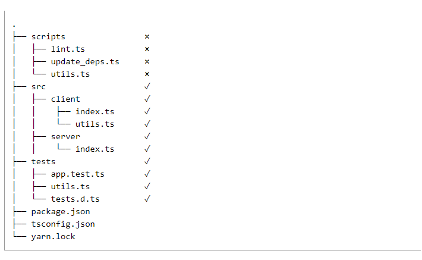

# TypeScript

**Type**: Type is a set of values that share something in common.

- Superset of JavaScript(JavaScript code can be directly placed in TypeScript file.).(JavaScript + Type System)
- It is a static type-checker
- It helps to check the Non-exception failures
- Types for tooling
- It has explicit type metiontiniong(Strong Typing)
- Downleveling
- Structural Type System("Duck typing" or "structural typing")
- TS supports the OOP.

# JavaScript vs TypeScript

- Type System: JS is dynamically typed. TS is statically typed.
- Syntax: JS code is valid in TS. However, TS is not valid in JS.
- Tooling : TS provided additional support through static-type checking. JS lacks this feature.
- Compatability: JS is supported by all the web browsers. TS has to be transpiled to JS to run in a web browser.
- Maintability: TS provides improved maintainability as the errors are identified(caught) during the compile time.
- User Community: JS has wide range of users when compared to TS.

# How to use TS

## Node and npm

**Node**: JS runtime enviorment built on V8 engine. It is used to run JS files outside the browser. 

**npm**: Default package manager for Node. It is used to discover, install js packages and integrate the 3rd party libraries.

## `package.json`

- The `package.json` conatines configuration informantion( metadata) about a JS project and versioning of  its dependencies(production) and dev dependencies(dev/test).

```console
npm init
```
install dependencies and devDependencies.
```console
npm install
```
install dependencies

```console
npm install --production
```
install dev dependencies
```console
npm ic
```


Note: `^` will fi the major version and `~` will also fix the minor along with major version.
Note: after npm install `package-lock.json` is generated which containes the versioning information of installed dependencies.(Read-only)

## `tsconfig.json` ( also called as `jsconfig.json`)

-  they are placed in the root directory of the project.


-  configuration information of the TS project.
  
**Compiler Options**

- This makes the bulk option sof a tsconfig.json file.
   - target: specific the target version of JS.
   - include: used to specify whoch files should be considered for `tsc`.
   - excluede: used to specify which filed should be excluded from the included file while running the `tsc`.
   - strict: examples `noImplicitAny` , `alwaysStrict` are examples. In compiler options various aother option similar to these can configured to configure the strictness of the compilation.


# Variable Data types

1. Primitives
  - string
  - number
  - boolean
  - null
  - undefined
  - bigint
  - symbol


**Array**
**Object**

**Literal Types:**  variables declared using const are literals.

## Special types

1. any : type is not defined during declaration
2. unknown: type is not defined during declaration but should be explicity type checked before performaing any operation.

### Type Annotations

- Light weight ways to record the intended contract of function or variable.

# Function

- explicit parameter type delaration 
- explicit return type declaration

# Type alias 

- A type alias is a name for any type.

```ts
type TypeName = {
  //properties
}
```

# Interfaces

An interface decleraton is another way to name an object type:


```ts
interface Name{
  //properties
}
```

**Type alias vs Interfaces:**

- The key difference between these two is type alias cannot be repoened to add new properties(extendable). Interface can be extendable.


# Composing types

TypeScript allows you to create complex types by combining simple ones.
## Union Types

With Union, you can declare that a type could be one of many types.

Ex:

```ts
type PromiseState = "Pending" | "Resolved" | "Rejected"
```

```ts
function returnUserIdLength(userId: string | number ){
   return userId.length;
}
```


## Generics

Generics provide variables to types. defined in `<>`.
Ex: 

```ts
type StringArray = Array<string>;
```

**keyof**:  `keyof` operator takes all the keys of an object type and return the literal union of its keys.

# Utility types

- Utility types are used for type transformations.

1. `Awaited<Type>`: It is used  for type transformation for async-await and promises.
2. `Partial<Type>`: It is used to construct a type with properties as optional.
3. `Required<Type>`: Its is used to construct a type with alll the properties.
4. `ReadOnly<Type>`: It  is used to construct a type with properties as read only.(Frozen Object)
# Type Gaurds

- Type gaurds are used to narrow down the type of variables using conditional blocks.
- typeof: other prmitive types
- instanceof: object
- custom type predicates

# Realdonly Interface

- To make all the properties if interface as readonly(constant) use `ReadOnly<Type>`.
- To restrict one or many properties in interface as readlony(constant) use `readonly` before the variable decleration.

**Classes and Access Modifiers**

# Casting

- TypeAssertions
- Generics

# Module Importing and Exporting

Module: Modules are executed within their own scope. The variables, classes, interfaces declared in a module are not visible ouseide the module(no global scope) unless they are exported using `export` forms and imported using `import` forms. 


# Decorators

A decorator is a function used to extend the functionality or annotate with datada for:

1. Class
2. Class Property
3. Class Method
4. Class Accessor
5. Class method parameter


There are five types of decorators:

1. Class Decorator
2. Property Decorator
3. Method Decorator
4. Accessor Decorator
5. Parameter Decorator


```ts
@classDecorator
class Bird {
  @propertyDecorator
  name: string;
  
  @methodDecorator
  fly(
    @parameterDecorator
      meters: number
  ) {}
  
  @accessorDecorator
  get egg() {}
}
```


